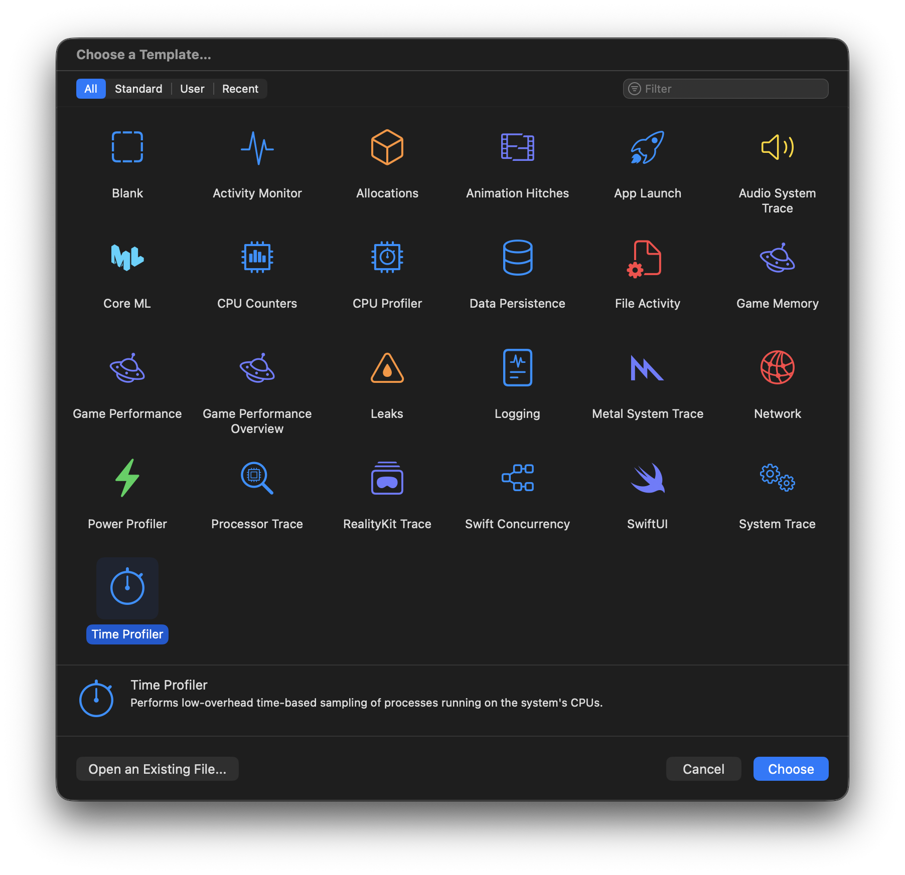
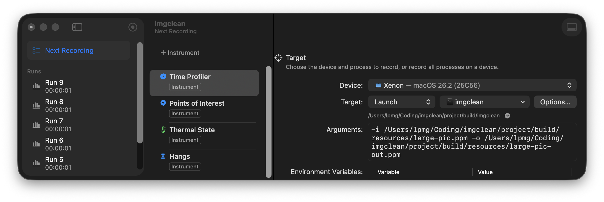
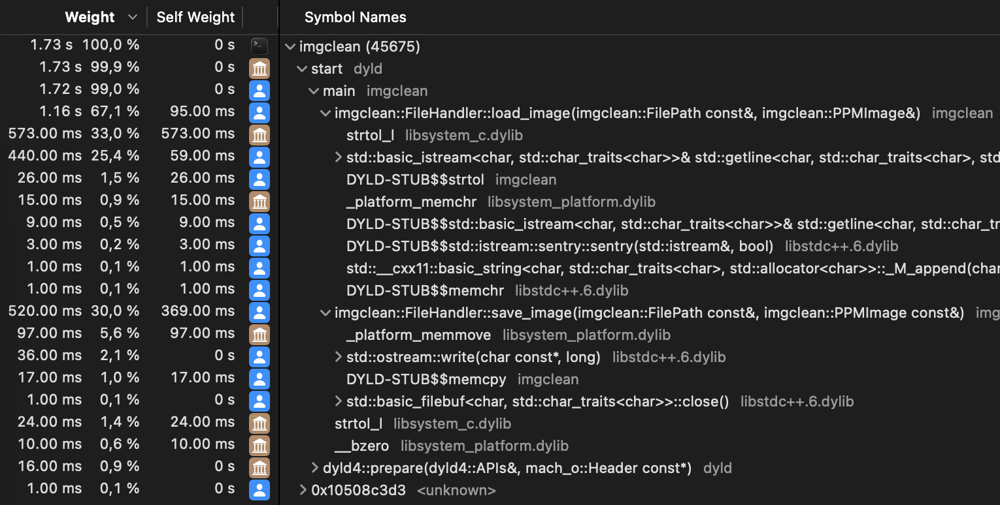
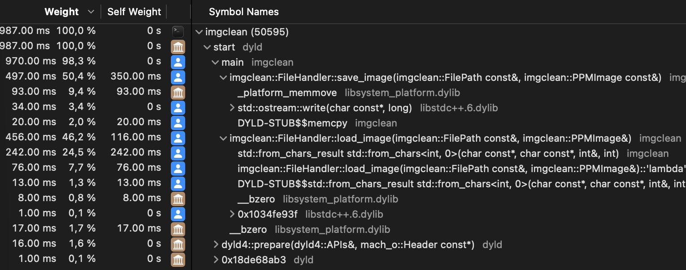
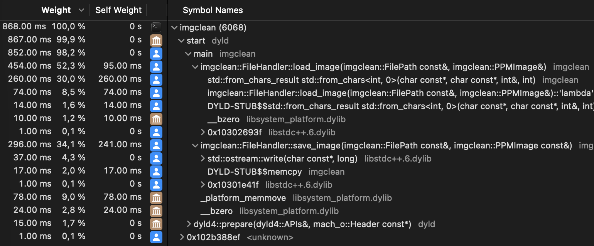

# Report on Exam Assignments - Lecture 10

## Task 1

**Discuss Donald Knuth’s original quote about premature optimization (page 16). What is your opinion?**

Quote:

```
There is no doubt that the grail of efficiency leads to abuse. Programmers waste
enormous amounts of time thinking about, or worrying about, the speed of
noncritical parts of their programs, and these attempts at efficiency actually have
a strong negative impact when debugging and maintenance are considered. We
should forget about small efficiencies, say about 97 % of the time: premature
optimization is the root of all evil.

Yet we should not pass up our opportunities in that critical 3%. A good
programmer will not be lulled into complacency by such reasoning, he will be
wise to look carefully at the critical code; but only after that code has been
identified. It is often a mistake to make a priori judgements about what parts of
a program are really critical, since the universal experience of programmers who
have been using measurement tools has been that their intuitive guesses fail.
After working with such tools for seven years, I’ve become convinced that all
compilers written from now on should be designed to provide all programmers
with feedback indicating what parts of their programs are costing the most;
indeed, this feedback should be supplied automatically unless it has been
specifically turned off.
```

I fully agree with Knuth's perspective on premature optimization. This is mostly because I have experienced it myself during a previous project. A classmate and I were working on a university project, where optimization was an important part of the assignment. We had learned about profilers already during a lecture, but did not really care to actually use one. Instead, we spent a lot of time trying to optimize parts of our code that we thought were critical, but in the end, these optimizations had little to no effect on the overall performance of our program. I remember one specific case, where performance even became worse: 
I saw a commit "minor optimizations" in the git history, tried to run the code and noticed that it was slightly slower than before. What my classmate had done was:
1. manually collapse nested arrays: `array[i][j]` -> `array[i * j]` (and then access it with the calculated index)
2. iterate through loops in reverse order: `for (i = 0; i < n; i++)` -> `for (i = n-1; i >= 0; i--)`

In both cases, it might have looked like it could improve performance, but in reality, it just made the code harder to read and maintain, and even resulted in worse 
performance. If we had used a profiler from the beginning, we would have identified the actual bottlenecks in our code and focused our optimization efforts there, rather than wasting time on premature optimizations that didn't result in significant benefits.

## Task 2

**Select one slide from the lecture, research more about the topic, and report on it. (except pages 15–16)**

All of the tools which were mentioned in the lecture were very interesting, however they are all constrained to either Intel processors or Linux operating systems. Personally, I am using a Macbook with an Apple Silicon (M3 Pro) processor, so I was interested in finding similar tools for my platform. This will be especially useful for the project I am currently working on for this class.

After some research, I found that `Instruments` is a powerful performance analysis and testing tool that comes bundled with Xcode on macOS. It provides a suite of tools for profiling and analyzing the performance of applications. With Instruments, developers can monitor various aspects of their applications, including CPU usage, memory allocation, disk activity, and network performance.

For the image enhancer project, I had already implemented a `FileHandler` class to read and write image files. While writing the code, I had paid a lot of attention to performance, so I was curious to see if I could use Instruments to improve the performance even further. Specifically, I decided to use the Time Profiler instrument to analyze the CPU usage of my application:



In the Time Profiler, I selected "Next Recording" and then selected the compiled binary of my image scanner application. The run arguments I provided were `-i /Users/lpmg/Coding/imgclean/project/build/resources/large-pic.ppm -o /Users/lpmg/Coding/imgclean/project/build/resources/large-pic-out.ppm`, which means that the program will load a `.ppm`-File into a `std::vector` of pixel intensities and then simply write it back to another file. For benchmarking purposes, I used a large image file (6700 × 4467, 4.2MB).



To start profiling, I clicked the red record button in the top left corner:

After the program finished executing, the profiler showed me the following results:



We can see that the program took 1.73 seconds to complete, where loading the image took 1.16 seconds (at 67,1%) and writing it back took 0.52 seconds (at 30%). This showed me that I should first investigate the loading process, because there might be the largest potential for optimization there. If we look closer, we can see that the most time is spent on the `strtol` calls (which are used to convert the ASCII pixel values to integers). The icon (macOS library symbol) next to the time indicates that this is a system function, which means that I cannot optimize it directly. However, I could try to replace it with a different and more performant function. I went back to my code and replaced the `strtol` calls with `std::from_chars`, which is a C++17 feature that provides a fast way to convert strings to numbers. Furthermore, I cleaned up the code a bit to improve readability. The result of the second run is as follows:



The first and probably most important observation is that the total runtime has decreased from 1.73 seconds to just 987 milliseconds, which is a significant improvement. The optimization of the loading process is clearly visible, as it now only took 456 milliseconds (at 46.2%) instead of 1.16 seconds. The profiler now shows that the most time is spent on the `save_image` function at 497 milliseconds (at 50.4%). Here, the `memmove` function is the most time-consuming part, which is also a system function. Here, the optimization was not as straightforward as before, but to explain it shortly: I changed the implementation to a buffered write approach. I used an 1 Mib buffer where the pixel data is written to and as soon as the buffer is full, it is flushed to the file. This reduces the number of `memmove` calls significantly, which results in a faster write process. The final result after this optimization is as follows:



The total runtime has now decreased to just 868 milliseconds, which is a huge improvement compared to the original implementation. Saving the image only took 296 milliseconds (at 34.1%) and the loading process is the most time-consuming part again.

At this point, I had invested quite a bit of time into optimizing the code, so I decided to stop here. I was also very happy with the results and the profiler itself. Without its help, I would have never guessed that `strtol` and `memmove` were the bottlenecks in my code. 

As an additional note, I did not just do three runs in practice. Performance can vary between runs due to various factors unrelated to the code itself, so what is shown in this report are mostly the best runs and not just the first three attempts. Furthermore, I am also out of time to explore the other profiling tools that Instruments provides, but I am sure to do so in the future in order to further improve the image enhancer project (as soon as the main functionality is implemented).