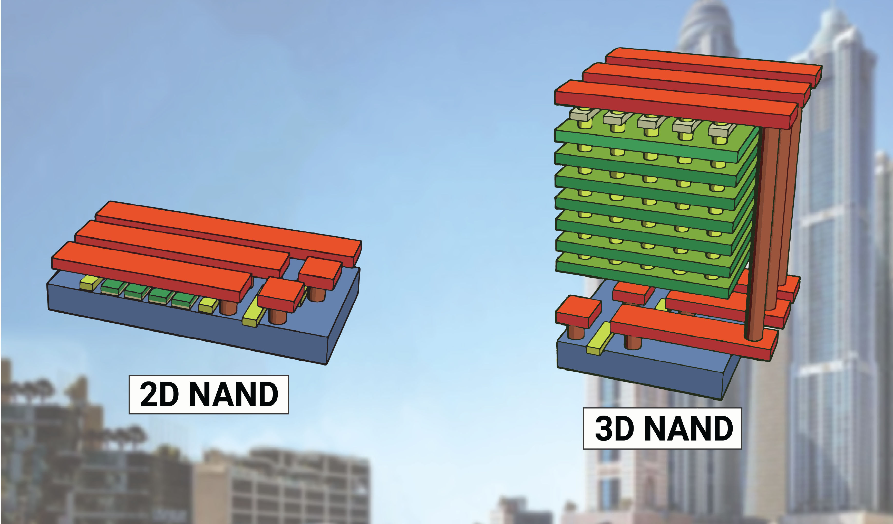

# Report on Exam Assignments - Lecture 11

## Task 1

**Select one slide from the lecture, research more about the topic, and report on it.**

For this report, I'd like to talk about a very recent topic which is and will stay relevant even in the coming years: 3D NAND Flash Memory. I'm not quite sure to which slide this fits best, but I would assume slide 4 (introduction of NAND memory and cell types) or slide 8 where a 2D die layout is shown.

In the lecture, we have discussed that in order to increase storage density, chipmakers might use an increased number of bits per cell (SLC -> MLC -> TLC -> QLC). However, this approach decreases performance and durability of the memory. Another appraoch was to simply shrink the size of the memory cells, to fit more cells on the same die area. This trend continued until the early 2010s, when physical and technical limitations made further shrinking impractical.

Since then, NAND manufacturers have taken another approach to increase storage density: stacking memory cells vertically, resulting in 3D NAND (also known as Vertical NAND or V-NAND) Flash Memory. Key advantages of 3D NAND over 2D NAND include increased speed, power efficiency, and a longer lifespan. A comparison of how 2D NAND and 3D NAND are structured is shown below:

But how many layers are we actually talking about here? Are there any limits?

While early versions (for example by Micron, see sources) used 32 and later even 64 layers, modern 3D NAND chips can have over 200 layers. Examples include Kioxia’s 218-layer, Micron’s 232-layer, and Samsung’s 286-layer offerings. Recent headlines predict that in 2027, we might even see 500-layer 3D NAND chips with 4800 MT/s speeds. Not only do more layers increase the number of cells on the same die area, it also benefits internal latency by shortening paths and optimizing topology. However, the main limitation to the number of layers is the manufacturing process itself, as stacking more layers increases complexity and cost. The more steps are required to build the chip, the higher the chance of defects occurring during production. This might lead to lower yields and higher production costs. After all, manufacturers depend on commercial success, which is why they have to find a balance between yields (therefore also costs) and market demand.

Lastly, I would like to mention that in addition to stacking more layers vertically, manufacturers are also exploring PLC (penta-level cell) technology, which stores 5 bits per cell. This could further increase storage density, but also comes with its own set of challenges regarding performance and durability.

I found a lot of very interesting articles on this topic, but I was not able to include all the information in this report. So at least, I would like to share some sources for further reading:

My main sources which I can totally recommend are:
- [The Evolution of NAND Flash Memory](https://digitrendz.blog/newswire/technology/33981/the-evolution-of-nand-flash-memory/)
- [3D NAND Memory Forecast to 2027: Layers, Speed, and Storage Capacity](https://www.guiahardware.es/en/3D-NAND-memory-forecast-for-2027%3A-speed-and-storage-capacity/)

In addition, I've also used:
- [3D NAND Flash 再進化!!](https://www.hkepc.com/16749/3D_NAND_Flash_再進化_預計_2021_年可實現_140_層堆疊) - for graphics only!
- [The evolution of NAND - Micron Technology](https://www.micron.com/about/blog/memory/nand/the-evolution-of-nand)
- [Flashback : The Evolution of NAND Flash Technology - SK hynix](https://news.skhynix.com/flashback-the-evolution-of-nand-flash-technology/)

## Task 2

**Read the paper** _Designing SSD-friendly Applications for Better Application Performance and Higher IO Efficiency_**. Discuss two things you find particularly interesting.**

What I found most interesting is that although in-place updates are a popular optimization technique for HDDs, they can actually hurt performance on SSDs. HDDs use a spinning disk to store data and a head that is used to read and write data. When data is supposed to be updated, the head needs to move to the correct position on the disk, which can take a significant amount of time. By using in-place updates, no seeking and repositioning of the head is necessary, which improves performance. However, this is very different for SSDs. Firstly, SSDs have no moving parts, so there is no seek time to be optimized and this technique does not provide any benefit. Secondly, due to the way NAND Flash memory works, a page containing data cannot be overwritten directly. Instead, the page must first be read into a buffer, modified, and then written to a new location. The old page is then marked as invalid and will be cleaned up later by the SSD's garbage collection process. This means that an in-place update on an SSD is not really an in-place update at all, but rather a random update with extra steps. The paper shows that random updates (which do not try to overwrite existing data) can achieve similar or even better performance on SSDs compared to in-place updates. The authors also explain that in-place updates can actually lead to higher data corruption rates, as unnecessary reads can affect neighboring cells which store data.

This made me wonder how much legacy software still relies on in-place updates for performance optimizations, because it was written when HDDs were the dominant storage technology. Especially because of the saying "if it works, don't fix it", many applications might not have been updated to take advantage of SSDs characteristics.

As a side note: I was confused at first by the graphs on page 373. For both (a) HDD and (b) SSD they show that random updates achieved a higher QPS than in-place updates. However, the text states that random updating achieved around 170 qps and in-place updating achieved around 280 qps on the HDD. Assuming the text is correct, I think the bars in the HDD graph are mislabelled and the In-place QPS should be higher than Random QPS. I'm not sure about the SSD graph, as they only mention that the values are similar.

The second interesting point I found was that for small IO, many threads should be used and for large IO, fewer threads should be used.

Firstly, the authors explain that although an SSD already provides various levels of internal parallelism, a single IO thread is not enough to fully take advantage of this parallelism. In the example experiment, two threads were able to double the throughput of a 10KB write operation compared to a single thread. Using 4 threads doubled the throughput again.

Next, the authors describe what they mean by small and large IO and why the number of threads should be adjusted accordingly. Small IO is defined as any IO size that can not fully utilize the SSD's internal parallelism. Assuming a page size of X KB and an internal parallelism of Y levels, the border between small and large IO would be at X * Y KB. For large IO, the SSD's internal parallelism is already fully utilized, so adding more threads would only add overhead and decrease performance. The authors recommend 1-2 threads here. For small IO, however, more threads can help to increase parallelism and improve performance.

Personally, I have never considered adjusting the number of threads based on IO size before. In our text image cleaner project, we implemented a 1MB buffer which is filled and then flushed to disk. This was already so fast on my machine that any OpenMP parallelization actually made it slower due to overhead. However, in a future scenario where I'm working with much smaller IO sizes, I will definitely consider using more threads to try to improve performance.