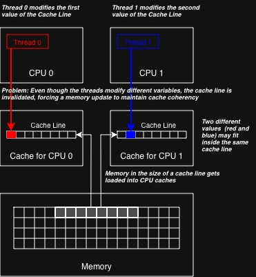

# Report on Exam Assignments - Lecture 2

## Task 1

**What causes false sharing? Describe it visually by creating your own graphic.**



## Task 2

**Read the paper There’s plenty of room at the Top: What will drive computer performance after Moore’s law? Explain in detail the figure Performance gains after Moore’s law ends.**

The lower part of the figure is labeled "The Bottom" and represents the foundation, on which computer performance gains in the last 50 years have built on. According to Moore's law, the number of transistors on a computer chip doubles every two years. This meant that simply relying on improvements in semiconductor technology yielded predictable, broad-based gains in computer performance. However, it is becoming increasingly hard to keep Moore's law up. In order to double the number of transistors, each individual transistor needs to shrink in size. Lately, the process of transistor miniaturization has started to stall. On one hand, we have reached the limits of physics since the physics of materials changes at atomic levels. On the other hand, we have also reached the limits of what is economically feasible to manufacture.

The upper two-thirds of the figure show other opportunities for computer performance gains. Now that it has become harder to squeeze out performance at "The Bottom", the three mentioned technologies could be used to further increase performance:

**Software**

Software can be made more efficient by performance engineering. This practice aims to reduce inefficiencies in programs (bloat) and also looks as customization of software to the underlying hardware. Certain hardware might be equipped with accelerators such as matrix or vector units, which could speed up calculations of a program if used correctly.

**Algorithms**

Engineering more-efficient algorithms can also yield performance gains, however rather unevenly and ultimately with diminishing returns. An originally naive algorithm might be improved by a lot if a new and more efficient approach is found, but once the algorithm is reaching the minimally required theoretical complexity of the problem, performance gains will stall as well. The biggest benefits can be seen when looking from a different direction: engineering algorithms for new problem domains (e.g., machine learning) and from developing new theoretical machine models that better reflect emerging hardware.

**Hardware**

The third technology in the figure is hardware architecture. Here, the process of hardware streamlining is used to increase computer performance. An example would be processor simplification, where complex processing cores are simplified in order to shrink their footprint. This in return allows placing more cores on the same chip. Another example is domain specialization, where hardware is customized for a particular application domain. Lately, this is heavily used in machine learning applications, where floating-point precision is decreased from the 32 bits to 16, 8 or even 4 bits.

In conclusion, the figure shows three opportunities to keep up the gains in computer performance (The Top) in the post-Moore era, where steady performance gains are no longer guaranteed by advancements in semiconductor technology (The Bottom).

## Task 3 (optional)

**Do the coding warmup on slide 20.** 

### 1. Fix the race condition bug on page 13 with a std::mutex.

Solution: See `code/fixed_race_condition.cpp`

Execution:

```
> g++-15 -fopenmp fixed_race_condition.cpp -o fixed_race_condition
> ./fixed_race_condition                                          
pi with 1000000000 steps is 3.1415926535897687 in 0.379128 seconds
```

### 2. Reduce the runtime of the image denoising program on slide 16 by adding an appropriate schedule.

Instead of statically giving each thread the same number of loop iterations (default), this can be done dynamically during runtime using `schedule(dynamic)`.

Solution: See `code/unbalanced_workload.cpp` and `code/fixed_unbalanced_workload.cpp`.

Execution:

```
> g++-15 -fopenmp unbalanced_workload.cpp -o unbalanced_workload.o   
> g++-15 -fopenmp fixed_unbalanced_workload.cpp -o fixed_unbalanced_workload.o
> ./unbalanced_workload.o 
0.509375 seconds
> ./fixed_unbalanced_workload.o 
0.236174 seconds
```

The code is now a little over 2.1 times faster!

### 3. What schedule on slide 18 produces the following (bad) pattern?

`schedule(static, 22)`

The first thread that receives 'work' will compute the first 22 iterations (0-21) and the second thread to receive 'work' will take the rest (22-31).

## Task 4

**Rewrite the program for estimating π from the last lecture (pi_numerical_integration.cpp) so that it is parallelized with the #pragma omp for construct.**

Solution: See `code/pi_numerical_integration.cpp`

Execution:

```
> g++-15 -fopenmp pi_numerical_integration.cpp -o pi_numerical_integration  
> ./pi_numerical_integration
pi with 1000000000 steps is 3.1415926535896603 in 0.226869 seconds
```