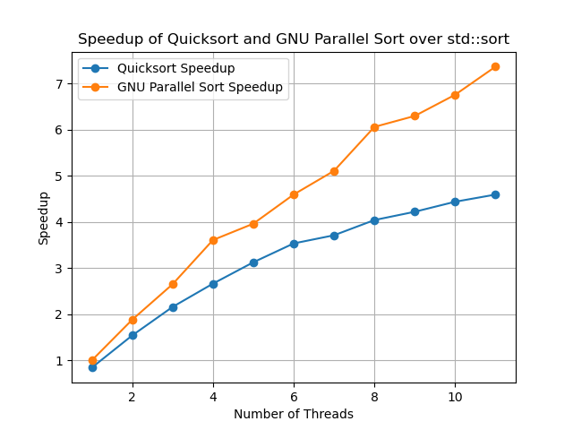
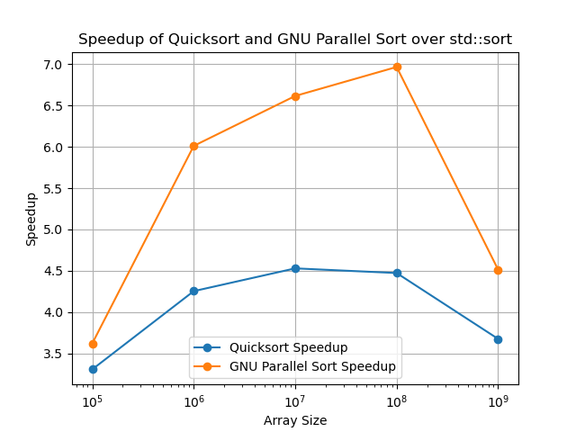

# Report on Exam Assignments - Lecture 4

## Task 1

**Benchmark min_max_quicksort against std::sort and __gnu_parallel::sort. (you can adjust min_max_quicksort.cpp as necessary)**

### 1. Provide details of your benchmarking environment.

- Operating System: MacOS 26.1
- RAM: LPDDR5-6400 36GB unified memory (shared between CPU and GPU)
- CPU: 
    - Apple M3 Pro
    - 5 performance CPU cores; 0.70 to 4.06 GHz;
    - 6 efficiency CPU cores; 0.74 to 2.75 GHz;
    - L1 cache:
        - P-Cores: 192 + 128 KiB per core
        - E-Cores: 128 + 64 KiB per core
    - L2 cache:
        - P-Cores: 16 MiB
        - E-Cores: 4 MiB
- Compiler: g++-15 (Homebrew GCC 15.2.0) 15.2.0

### 2. Create a graph where the x-axis represents the number of threads and the y-axis displays the relative speedup over std::sort.



Solution: See `code/min_max_quicksort_threads.cpp` and `code/graphs.py`

Execution:

```
> g++-15 -fopenmp -march=native -Ofast min_max_quicksort_threads.cpp -o min_max_quicksort_threads     
> ./min_max_quicksort_threads 
Benchmarking with 1 threads:
  std::sort time: 5.60108 s
  min_max_quicksort time: 6.67184 s
  speedup over std::sort: 0.83951
  __gnu_parallel::sort time: 5.6176 s
  speedup over std::sort: 0.99706
Benchmarking with 2 threads:
  std::sort time: 5.58609 s
  min_max_quicksort time: 3.63217 s
  speedup over std::sort: 1.53795
  __gnu_parallel::sort time: 2.97246 s
  speedup over std::sort: 1.87928
Benchmarking with 3 threads:
  std::sort time: 5.6435 s
  min_max_quicksort time: 2.61673 s
  speedup over std::sort: 2.1567
  __gnu_parallel::sort time: 2.13055 s
  speedup over std::sort: 2.64885
Benchmarking with 4 threads:
  std::sort time: 5.75403 s
  min_max_quicksort time: 2.16207 s
  speedup over std::sort: 2.66135
  __gnu_parallel::sort time: 1.5949 s
  speedup over std::sort: 3.60776
Benchmarking with 5 threads:
  std::sort time: 5.72041 s
  min_max_quicksort time: 1.83048 s
  speedup over std::sort: 3.12509
  __gnu_parallel::sort time: 1.44374 s
  speedup over std::sort: 3.96222
Benchmarking with 6 threads:
  std::sort time: 5.74047 s
  min_max_quicksort time: 1.62421 s
  speedup over std::sort: 3.53431
  __gnu_parallel::sort time: 1.24923 s
  speedup over std::sort: 4.59522
Benchmarking with 7 threads:
  std::sort time: 5.73964 s
  min_max_quicksort time: 1.54646 s
  speedup over std::sort: 3.71147
  __gnu_parallel::sort time: 1.12342 s
  speedup over std::sort: 5.10908
Benchmarking with 8 threads:
  std::sort time: 5.77042 s
  min_max_quicksort time: 1.42785 s
  speedup over std::sort: 4.04133
  __gnu_parallel::sort time: 0.951945 s
  speedup over std::sort: 6.06171
Benchmarking with 9 threads:
  std::sort time: 5.80416 s
  min_max_quicksort time: 1.375 s
  speedup over std::sort: 4.22122
  __gnu_parallel::sort time: 0.921269 s
  speedup over std::sort: 6.30018
Benchmarking with 10 threads:
  std::sort time: 5.81588 s
  min_max_quicksort time: 1.3102 s
  speedup over std::sort: 4.43891
  __gnu_parallel::sort time: 0.860385 s
  speedup over std::sort: 6.75963
Benchmarking with 11 threads:
  std::sort time: 5.80396 s
  min_max_quicksort time: 1.26336 s
  speedup over std::sort: 4.59407
  __gnu_parallel::sort time: 0.78761 s
  speedup over std::sort: 7.36908
```

### 3. Construct another graph with the x-axis denoting the array size and the y-axis illustrating the relative speedup over std::sort.



Note: The maximum array size I tested was 10^9, because the next step-up (10^10) would have exceeded my memory in size.

Solution: See `code/min_max_quicksort_array_sizes.cpp` and `code/graphs.py`

Execution:

```
> g++-15 -fopenmp -march=native -Ofast min_max_quicksort_array_sizes.cpp -o min_max_quicksort_array_sizes
> ./min_max_quicksort_array_sizes 
Benchmarking with array size 100000:
  std::sort time: 0.0037142 s
  min_max_quicksort time: 0.0011232 s
  speedup over std::sort: 3.3068
  __gnu_parallel::sort time: 0.0010258 s
  speedup over std::sort: 3.62078
Benchmarking with array size 1e+06:
  std::sort time: 0.042359 s
  min_max_quicksort time: 0.0099584 s
  speedup over std::sort: 4.25359
  __gnu_parallel::sort time: 0.0070464 s
  speedup over std::sort: 6.01144
Benchmarking with array size 1e+07:
  std::sort time: 0.518301 s
  min_max_quicksort time: 0.114438 s
  speedup over std::sort: 4.52912
  __gnu_parallel::sort time: 0.0783436 s
  speedup over std::sort: 6.61574
Benchmarking with array size 1e+08:
  std::sort time: 5.55762 s
  min_max_quicksort time: 1.24257 s
  speedup over std::sort: 4.47268
  __gnu_parallel::sort time: 0.79774 s
  speedup over std::sort: 6.9667
Benchmarking with array size 1e+09:
  std::sort time: 65.737 s
  min_max_quicksort time: 17.8847 s
  speedup over std::sort: 3.6756
  __gnu_parallel::sort time: 14.5618 s
  speedup over std::sort: 4.51434
```

### 4. Explain any patterns or trends observed in the graphs, and offer potential reasons for these findings.

**Thread Count vs Speedup**

When looking at the graph that plots different thread counts against the speedups achieved over `std::sort`, a few patterns can be observed.

With 1 thread, both `__gnu_parallel::sort` and `min_max_quicksort` have a speedup of less than 1x, meaning that they are actually slower than `std::sort`. This could indicate the performance overhead of using a parallelization framework. Additionally, it seems that `min_max_quicksort` is not as optimized as `std::sort` and `__gnu_parallel::sort`.

With an increasing number of threads, the speedup increases as well. Both algorithms outperform `std::sort` as soon as more than one thread is used. However, for `min_max_quicksort`, the achieved speedup does not scale linearly with the number of threads. Instead, it follows a logarithmic curve, meaning that diminishing returns are receiving early on.

As for `__gnu_parallel::sort`, it roughly maintains linear scaling up until 4 threads. For any thread count higher than that, diminishing returns can be observed as well, although the speedup constantly stays above `min_max_quicksort`. 

The observations can likely be explained by the number of performance and efficiency cores, where the version running on up to 4 threads is primarily using performance cores and the versions with a higher thread count also utilize less performant efficiency cores, thus not reaching linear increases in speedup. Additionally, it seems like `min_max_quicksort` has worse load balancing or parellization capabilities than `__gnu_parallel::sort`, because they have similar performance when run sequentially but increasingly different performance with higher thread counts.

**Array Size vs Speedup**

When looking at the graph that plots different array sizes against the speedups achieved over `std::sort`, we can observe interesting patterns as well.

Both parallel algorithms peak around 10^7-10^8 elements, where `min_max_quicksort` achieves 4.5x speedup and `__gnu_parallel::sort` reaches nearly 7x speedup. At 10^5 elements, speedups are the lowest (3.3x and 3.6x respectively) due to parallelization overhead dominating the computation time. At 10^9 elements, the performance drops significantly. This is likely due to cache misses and memory bandwidth saturation. I did not try any array sizes larger than that, since the benchmark was already using around 75% of the system memory at peak.

We can also observe that `__gnu_parallel::sort` continuously outperforms `min_max_quicksort` here as well. While it is hard to find an exact reason without researching the implementation details, we can assume that `__gnu_parallel::sort` uses better memory management techniques and optimizations that allow it to better handle larger data sizes.

## Task 2

**Read** _What every systems programmer should know about concurrency._ **Discuss two things you find particularly interesting.**

The first topic I found particularly interesting was the distinction between strongly ordered and weakly ordered systems. The article explains that different architectures provide different ordering guarantees, also known as memory models. There are strongly ordered systems, such as x64 architectures, which generally ensure that memory operations are completed in a sequential order. Then there are weakly ordered systems, such as ARM architectures, which do not make this guarantee. This means that on weakly ordered systems, memory operations can be automatically reordered for optimization purposes, which can lead to unexpected behavior in concurrent programs if not handled properly. The article then shows an example of how to use memory barriers to enforce ordering on ARM architectures: one example is the `atomic` keyword in C++, which gets compiled into `dmb` instructions on ARM. These act as memory barriers and any memory operation that happens before the barrier in program order is guaranteed to be completed before any memory operation that happens after the barrier. For atomic functions, this means that the respective memory access is sandwiched between two `dmb` instructions.

The second topic I found interesting was the explanation of the `volatile` keyword in C++. I had heard of it before, and it was briefly mentioned in a previous lecture, but I had never fully understood its purpose. The article explains that `volatile` is used to inform the compiler that a variable's value can be changed by something besides the program that is being executed. When using the `volatile` keyword, the compiler will guarantee two things: first, it will not eliminate any loads and stores that seem "unnecessary". For example, if a variable is assigned a value multiple times in a row without any reads in between, the compiler will not optimize away the redundant assignments. This is because the variable might point to an `MMIO` register, where it would not be safe to assume that the write operations are redundant. Second, the compiler will not reorder any `volatile` operations with respect to other `volatile` operations. This means that if there are multiple `volatile` reads and writes in a program, the compiler will ensure that they are executed in the order they appear in the source code. However, it is important to note that `volatile` does not provide any guarantees about reordering with respect to non-volatile operations, nor does it emit any memory barriers. As a result, it can not be used for safe inter-thread communication.