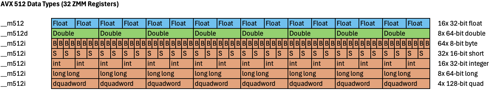

# Report on Exam Assignments - Lecture 7

# Task 1

**Explain three vectorization clauses of your choice that can be used with #pragma omp simd**

## aligned

This clause is used for data alignment. It informs the compiler that the data being processed is aligned to a specific byte boundary, which can enhance performance by allowing the compiler to generate more efficient SIMD instructions. The alignment value can be specified, for example, `#pragma omp simd aligned(ptr: 64)` indicates that the pointer `ptr` is aligned to a 64-byte boundary.

## collapse

This clause is used for loop fusion. It allows multiple nested loops to be combined into a single loop for vectorization. For example, `#pragma omp simd collapse(2)` would combine two nested loops into one, enabling the compiler to apply SIMD optimizations across the combined iteration space.

## safelen

This clause sets a limit for the vector length that the compiler may use. This is required for correctness when there are dependencies between iterations of the loop that could be violated by vectorization. For example, `#pragma omp simd safelen(16)` indicates that the compiler should not generate SIMD instructions that operate on more than 16 elements at a time.

# Task 2

**On slide 17 is a graphic for SSE data types and how these data types occupy the XMM vector registers, create a similar graphic for AVX512 data types (__m512, __m512d, _m512i), how they occupy ZMM vector registers.**

# Task 3

**Read the article** _Intel MMX for Multimedia PCs_. https://dl.acm.org/doi/pdf/10.1145/242857.242865 **Discuss two things you find particularly interesting.**

The most interesting aspect of the Intel MMX technology to me is its backward compatibility. New processors with MMX technology had to maintain compatibility with existing software, including operating systems and applications without modification. Furthermore, the coexistence of existing applications and new applications using MMX technology had to be ensured. The main technique for maintaining full compatibility of MMX technology was hiding it inside the existing floating-point state and registers. The applications themselves then check for the presence of MMX technology and use it if available.

Secondly, I found it very interesting how Intel MMX was designed with real-world use cases in mind, especially for multimedia applications. The article explains how the MMX technology includes instructions for saturating arithmetic, meaning that if a calculation exceeds the maximum value that can be represented, it will be set to that maximum value instead of wrapping around. This is useful for example when adding two color values, because the result shouldn't overflow into unrelated colors. With wrapping arithmetic, a dark polygon being shaded toward black may suddenly start having white pixels, which is undesirable. Saturating arithmetic would instead clamp it to black. 
The article also discusses how MMX technology includes instructions for parallel processing of multiple data elements, where operations on multiple pixels can be performed in parallel, significantly speeding up multimedia processing tasks.